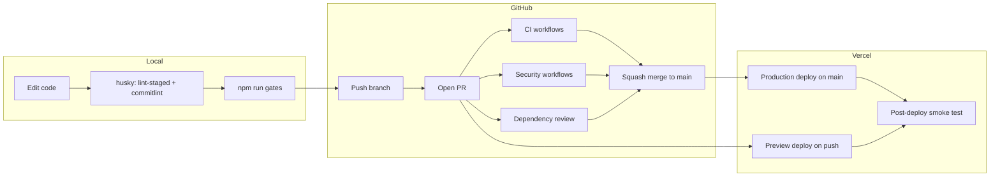

# CI/CD pipeline

EvalKit uses a **local → Git → Vercel** pipeline. Quality gates run before merge; Vercel deploys after merge via Git integration.



## Local (developer machine)

| Step | Command / hook | Purpose |
|------|----------------|---------|
| Pre-commit | `lint-staged` (husky) | ESLint on staged `.ts`/`.tsx` |
| Commit message | `commitlint` (husky) | Conventional Commits |
| Pre-push (manual) | `npm run gates` | Full L0–L2 + build — **required before slice commit** |

```bash
nvm use
npm ci
cp .env.example .env.local   # see docs/ENV.md
npm run gates                # run before every slice commit
npm run dev
```

See [CONTRIBUTING.md](./CONTRIBUTING.md) for trunk workflow.

## GitHub (CI / security)

Workflows run on **every push and pull request** (except where noted).

| Workflow | Job | Blocks merge? |
|----------|-----|---------------|
| [CI](../.github/workflows/ci.yml) | Quality gates | Yes |
| [CI](../.github/workflows/ci.yml) | Dependency audit (`npm audit --audit-level=high`) | Yes |
| [CI](../.github/workflows/ci.yml) | L3 eval alignment | Main only; advisory until Slice 10 |
| [Secret scan](../.github/workflows/secret-scan.yml) | Gitleaks | Yes |
| [CodeQL](../.github/workflows/codeql.yml) | SAST (JavaScript/TypeScript) | Yes on PRs to `main` |
| [Dependency review](../.github/workflows/dependency-review.yml) | New dependency risk | PRs only |
| [Deploy smoke](../.github/workflows/deploy-smoke.yml) | `/api/health` shape | After Vercel deploy; informational |

### Branch protection (`main`)

Configure in GitHub → Settings → Branches:

- Require pull request before merging
- Require status checks:
  - `Quality gates`
  - `Dependency audit`
  - `Gitleaks`
  - `SAST` (CodeQL)
- Require `Dependency review` on PRs (optional but recommended)
- Do not allow force pushes

Until `main` contains the full app, run the same checks on stacked PRs (`infra/*` → `infra/*` → `main`).

## Vercel (CD)

**Deploys are handled by the Vercel Git integration** (not a duplicate GitHub Actions deploy).

| Event | Vercel action |
|-------|---------------|
| Push to any branch | Preview deployment |
| Merge to `main` | Production deployment |

### One-time setup

1. [Vercel dashboard](https://vercel.com) → Project → **Settings → Git** → connect `runescry/evalkit`
2. **Settings → Environment Variables** — `AI_GATEWAY_API_KEY` (and later KV, Slack, etc.) for Preview + Production
3. **Settings → Git → Deployment Protection** (recommended): require GitHub checks (`Quality gates`, `Gitleaks`) before promoting production
4. Production URL is posted as a GitHub `deployment_status` — triggers [deploy-smoke](../.github/workflows/deploy-smoke.yml)

### Verify production

```bash
curl -s https://<your-production-domain>/api/health | jq
```

Expect `healthy: true` when AI Gateway credits and env vars are configured.

## What CI does *not* do

- **No live AI Gateway calls in unit/contract tests** — mocks only (`lib/test/mock-ai.ts`)
- **No secrets in the repo** — Gitleaks + `.env.example` placeholders
- **No duplicate Vercel deploy** — Git integration owns CD; Actions only smoke-test deployments

## Related docs

- [CONTRIBUTING.md](./CONTRIBUTING.md) — gates table, commits
- [ENV.md](./ENV.md) — environment variables
- [SECURITY.md](../SECURITY.md) — secrets and scanning
